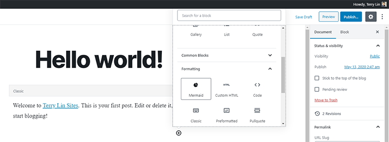
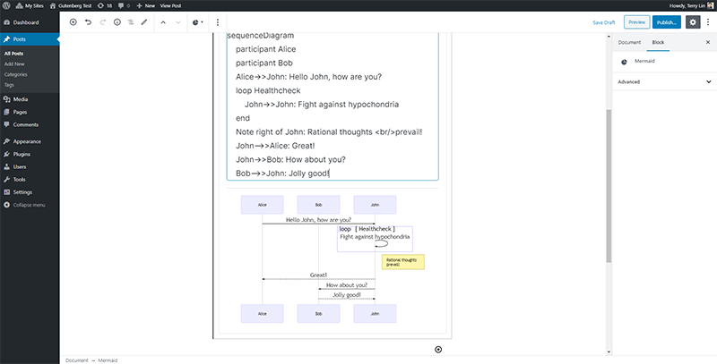

# WP Mermaid

Generation of diagrams and flowcharts from text in a similar manner as markdown by using [mermaid.js](https://mermaid-js.github.io/)

## Installation

1. Upload the plugin files to the `/wp-content/plugins/wp-mermaid` directory, or install the plugin through the WordPress plugins screen directly.
2. Activate the plugin through the 'Plugins' screen in WordPress.
3. Go to the WP Mermaid menu in Settings and set your options.

## How to use

WP Mermaid is smart enough that only load mermaid.js when your posts contain Mermaid syntax, by detecting the use of shortcode and block. So it will not be loaded on your website everywhere.

### Shortcode

In classic editor, you can use shortcode to render your Mermaid syntax. If you are using WordPress version below 5.0, this is the only way you can use.


```
[mermaid]
sequenceDiagram
    participant Alice
    participant Bob
    Alice->>John: Hello John, how are you?
    loop Healthcheck
        John->>John: Fight against hypochondria
    end
    Note right of John: Rational thoughts <br/>prevail!
    John-->>Alice: Great!
    John->>Bob: How about you?
    Bob-->>John: Jolly good!
[/mermaid]
```

### Gutenburg Block

Choose Mermaid block:



Fill in your Mermaid syntax in the editor.




### Author

[Terry Lin](https://terryl.in)

### License

GPLv3
